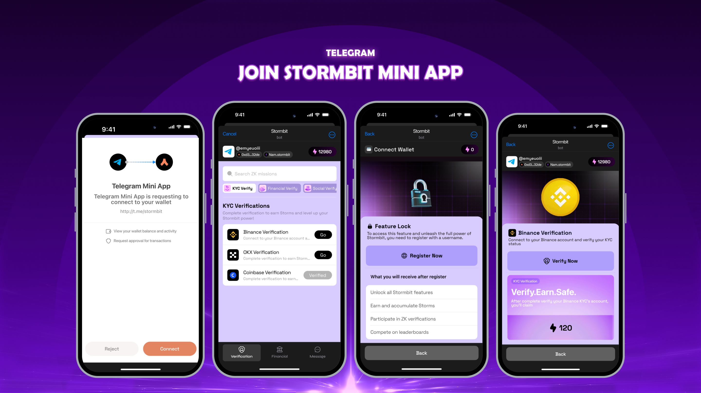

# Stormbit Mini App  
Decentralized lending infrastructure in your pocket 🌩️  

  

---

## 📱 Features  

### 1. Argent Wallet Integration  
Seamlessly manage your assets with the built-in **Argent Wallet**:
- 🔄 **One-click deposits and withdrawals** directly from your wallet.  
- 💰 **Real-time tracking** of balances and transactions.  
- 🔐 **Secure asset management** within a trusted environment.  
- 🪙 **Multi-token support** including ERC20 tokens and stablecoins.  
- ⚡ **Direct interaction** with smart contracts for loans and deposits.  

---

### 2. ZK-Verifications via Telegram App  
Quick and private identity verification with Telegram integration:
- **Connect** your Telegram account to Stormbit.  
- **Securely upload documents** via encrypted channels.  
- **Receive ZK-proof verification** without sharing sensitive data publicly.  
- **Use verified proof** to apply for loans and access platform features.  

---

### 3. Private Chat Channels for Lenders and Borrowers  
Facilitate secure communication and loan negotiations through private chats:  
- 🔒 **End-to-end encrypted** messaging for privacy.  
- 📝 **In-chat negotiation tools** to agree on loan terms seamlessly.  
- 📎 **Share documents and files** securely within the conversation.  
- 🔔 **Real-time notifications** for updates on negotiations and loans.  
- 📋 **Audit-ready chat logs** to keep a record of agreements.  

---

### 4. Mobile Loan Allocation  
Complete lending functionality directly from your mobile device:
- 📊 **Portfolio dashboard** for managing your assets and loans.  
- 🚀 **Instant loan requests** with just a few taps.  
- 🤝 **Real-time loan matching** between lenders and borrowers.  
- 📈 **Performance analytics** to track your investments and loans.  
- 📱 **Push notifications** to stay updated on all loan activities.  

---

## 🚀 Getting Started  

### Prerequisites  
To use the Stormbit Mini App, ensure you have:
- **iOS 14+** or **Android 8+**.  
- **Argent Wallet** installed on your device.  
- A **Telegram account** connected to Stormbit.  
- **Active internet connection** for real-time operations.  

---

## ⚙️ How to Contribute  
We encourage community involvement! If you want to contribute, open an issue or submit a pull request to improve the Stormbit Mini App.

---

Stay connected and enjoy the future of decentralized lending with **Stormbit** right from your phone! 🌩️  
